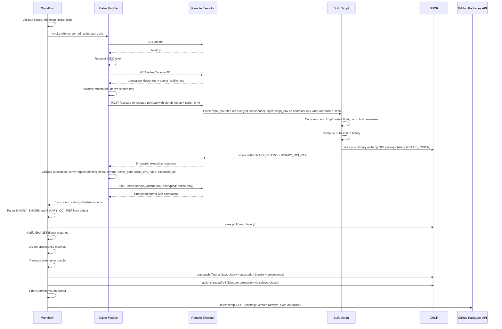

# Design Document: Attested Rust Build Pipeline

## Overview

This design describes a GitHub Actions workflow and supporting scripts that build a Rust binary inside an attested AWS Nitro Enclave environment, verify the binary's integrity, bundle it with attestation documents, push the result to GHCR as an OCI artifact via Oras, and create a GitHub Artifact Attestation for supply-chain provenance.

The system reuses the `call_remote_executor` Python module from the `github-runner-ec2-attestation-caller` project (copied into this repository) to handle the attested communication channel: health check, OIDC token acquisition, NitroTPM attestation validation, PQ_Hybrid_KEM key exchange, encrypted execution submission, output polling, and output integrity verification.

The build script runs on the Remote Executor inside the enclave, installs the Rust toolchain, compiles the binary, computes its SHA-256 digest, and pushes the binary to GHCR as a temporary OCI package using the `GITHUB_TOKEN` passed through the encrypted payload. The workflow then pulls the binary from GHCR, verifies its digest, creates a provenance manifest, pushes the final attested artifact to GHCR via Oras, creates a Sigstore-based GitHub Attestation, and cleans up the temporary package.

### Key Design Decisions

1. **Copy the caller module** rather than referencing it as a git submodule. This keeps the demo self-contained and avoids cross-repository dependency management. The module is placed at `.github/scripts/call_remote_executor/`.

2. **Use GHCR as the temporary transfer mechanism** for the binary. The Build_Script installs the Oras CLI, authenticates to GHCR with `GITHUB_TOKEN` via `oras login`, and pushes the compiled binary to a temporary OCI reference (`ghcr.io/<repo>/tmp-build/<tag>`) via `oras push`. The workflow pulls it back using `oras pull`. This avoids the deprecated GitHub Actions Artifacts v3 API and only requires `GITHUB_TOKEN` for authentication (no `ACTIONS_RUNTIME_TOKEN` or `ACTIONS_RUNTIME_URL` needed). The temporary package is cleaned up after the workflow completes.

3. **Use Oras CLI everywhere** for OCI artifact push/pull rather than Docker or raw OCI API calls. Both the build script (inside the enclave) and the workflow use Oras. The binary is not a container image — it's an arbitrary artifact with attestation metadata layers. Oras handles the OCI Distribution API details (blob upload, manifest creation) transparently.

4. **Two-layer attestation**: The Nitro attestation bundle proves the binary was built in a trusted enclave. The GitHub Artifact Attestation (Sigstore) proves the OCI artifact was produced by a specific GitHub Actions workflow run.

5. **Cleanup temporary GHCR packages** via `actions/delete-package-versions@v5` in an `if: always()` step. A preceding step looks up the version ID by tag using the GitHub REST API, then passes it to the action via `package-version-ids` to delete only the specific version.

## Architecture

### System Context Diagram

```mermaid
graph TB
    subgraph "GitHub Actions Runner"
        WF[Workflow: attested-rust-build.yml]
        CALLER[Caller Module<br/>call_remote_executor]
        SIGN[Signing & Packaging Script]
        ORAS[Oras CLI]
        GH_ATT[actions/attest@v4]
        CLEANUP[Cleanup Step<br/>delete-package-versions@v5]
    end

    subgraph "AWS Nitro Enclave"
        RE[Remote Executor Server]
        BS[Build Script: build-rust.sh]
        RUST[Rust Toolchain + Cargo]
    end

    subgraph "External Services"
        GHCR[GHCR<br/>ghcr.io]
        OIDC[GitHub OIDC Provider]
        SIGSTORE[Sigstore / Fulcio]
        GH_API[GitHub Packages<br/>REST API]
    end

    WF --> CALLER
    CALLER -->|"Attested Channel<br/>(PQ_Hybrid_KEM)"| RE
    RE --> BS
    BS --> RUST
    BS -->|"oras push temp binary<br/>via GITHUB_TOKEN"| GHCR
    CALLER -->|"OIDC Token"| OIDC
    WF -->|"Pull temp binary<br/>via Oras"| GHCR
    WF --> SIGN
    SIGN --> ORAS
    ORAS -->|"Push final OCI artifact"| GHCR
    WF --> GH_ATT
    GH_ATT -->|"Create attestation"| SIGSTORE
    GH_ATT -->|"Bind to OCI digest"| GHCR
    CLEANUP -->|"Delete temp package"| GH_API
```

### Sequence Diagram



## Components and Interfaces

### 1. Rust Project (`rust-project/`)

A minimal Rust project that compiles into the `attested-hello` binary.

**Files:**
- `rust-project/Cargo.toml` — Binary target `attested-hello`
- `rust-project/src/main.rs` — Prints version string and build timestamp

**Interface:** Source is at `/workspace/rust-project/` (read-only). The build script copies it to `/tmp/rust-project/` and compiles via `cargo build --release`, producing `/tmp/rust-project/target/release/attested-hello`.

### 2. Build Script (`scripts/build-rust.sh`)

Shell script executed by the Remote Executor inside the enclave.

**Inputs (environment):**
- Working directory: `/workspace` (repository root, mounted read-only by Remote Executor)
- `GITHUB_TOKEN` — passed via the encrypted execution payload's `script_env` dictionary
- `GITHUB_REPOSITORY` — the repository slug, passed via the encrypted execution payload's `script_env` dictionary
- `COMMIT_SHA` — the commit SHA being built, passed via the encrypted execution payload's `script_env` dictionary

**Note on `/workspace` read-only constraint:** The Execution_Container mounts the cloned project repository at `/workspace` as a read-only filesystem. The build script cannot write to `/workspace` (no `target/` directory, no file modifications). All write operations — Rust compilation output, Oras CLI installation, credential storage — must use `/tmp/`, which is the only writable directory. The build script copies the Rust project source to `/tmp/rust-project/` before compiling.

**Note on environment variable forwarding:** The environment variables are forwarded from the GitHub Actions runner to the Execution_Container via the `script_env` field in the encrypted /execute payload. The caller module includes them in the `script_env` dictionary, the Remote Executor server extracts and sanitizes the dictionary, and the Script_Executor injects them as container environment variables. This is necessary because the Execution_Container runs in an isolated Docker environment with no access to the GitHub Actions runner's environment.

**Note on GHCR upload mechanism:** The build script installs the Oras CLI and uses `oras login` + `oras push` to upload the binary to GHCR. Oras handles the OCI Distribution API details (blob upload, manifest creation) transparently. Authentication uses `GITHUB_TOKEN` as the password with `oras login ghcr.io`. This avoids the deprecated GitHub Actions Artifacts v3 API and eliminates the need for `ACTIONS_RUNTIME_TOKEN` and `ACTIONS_RUNTIME_URL`.

**Note on Oras installation in the enclave:** The enclave's Execution_Container only has `/tmp/` as a writable directory (since `/workspace` is mounted read-only). The build script downloads the Oras release tarball to `/tmp/`, extracts the `oras` binary to `/tmp/oras`, removes the tarball, and invokes Oras by absolute path (`/tmp/oras`). The `oras login` command stores credentials in `~/.docker/config.json` by default; since the home directory may not be writable, the `--registry-config /tmp/oras-auth.json` flag is used to store credentials in `/tmp/` instead. The latest stable version is 1.3.2.

**Outputs (stdout markers):**
- `BINARY_SHA256:<hex_digest>` — SHA-256 of the compiled binary
- `BINARY_OCI_REF:<reference>` — Full OCI reference of the temporary GHCR package (e.g., `ghcr.io/<repo>/tmp-build:<tag>`)

**Algorithm:**
```
1. Install Rust toolchain via rustup (if not present; RUSTUP_HOME and CARGO_HOME set to /tmp/)
2. Copy Rust project source to writable location: cp -r /workspace/rust-project /tmp/rust-project
3. cd /tmp/rust-project/
4. cargo build --release
5. Compute: sha256sum target/release/attested-hello → BINARY_SHA256
6. Generate unique tag: <short-sha>-<random-suffix>
7. Install Oras CLI v1.3.2 (download and extract entirely within /tmp/):
   curl -L -o /tmp/oras_1.3.2_linux_amd64.tar.gz https://github.com/oras-project/oras/releases/download/v1.3.2/oras_1.3.2_linux_amd64.tar.gz
   tar -zxf /tmp/oras_1.3.2_linux_amd64.tar.gz -C /tmp oras
   rm -f /tmp/oras_1.3.2_linux_amd64.tar.gz
8. Login to GHCR: echo $GITHUB_TOKEN | /tmp/oras login ghcr.io --username github --password-stdin --registry-config /tmp/oras-auth.json
9. Push binary: /tmp/oras push --registry-config /tmp/oras-auth.json ghcr.io/<GITHUB_REPOSITORY>/tmp-build:<tag> \
     --annotation "org.opencontainers.image.source=https://github.com/<GITHUB_REPOSITORY>" \
     /tmp/rust-project/target/release/attested-hello:application/octet-stream
10. Print BINARY_SHA256:<digest> and BINARY_OCI_REF:ghcr.io/<GITHUB_REPOSITORY>/tmp-build:<tag>
```

**Error handling:** Each step checks exit codes. Failures print descriptive errors to stderr and exit non-zero.

### 3. Caller Module (`.github/scripts/call_remote_executor/`)

Copied from `github-runner-ec2-attestation-caller`. This is the Python package that handles the full attested communication lifecycle.

**Files (copied as-is):**
- `__init__.py`, `__main__.py`, `cli.py`, `caller.py`, `encryption.py`, `attestation.py`, `artifact.py`, `errors.py`

**Interface:** Invoked as `python .github/scripts/call_remote_executor --server-url ... --script-path ... --github-token ... --root-cert-pem ... --expected-pcrs ... --attestation-output-dir attestation-documents --script-env GITHUB_REPOSITORY=... --script-env COMMIT_SHA=...`

**Note on mandatory nonces:** The Remote Executor requires a non-empty `nonce` field in every encrypted /execute and /execution/{id}/output request. The caller generates a unique 64-character hex nonce (32 random bytes) for each request. Missing or empty nonces are rejected with HTTP 400.

**Note on `/output` endpoint authentication:** The Remote Executor's `/output` endpoint authenticates callers solely by possession of the execution-bound Shared_Key established during the PQ_Hybrid_KEM exchange on `/execute`. Successful decryption of the encrypted payload proves the caller's identity — no separate OIDC token validation is required. The caller's `poll_output` method sends only `nonce` (and optionally `offset`) in the encrypted payload; no `oidc_token` field is needed. The `nonce` field is mandatory — the server rejects requests with missing or empty nonces with HTTP 400. The server returns 400 for decryption failures and 404 for unknown execution IDs — it does not return 401/403 on this endpoint.

**Note on execution-acceptance attestation verification:** After receiving the /execute response, the caller validates the execution-acceptance attestation and performs request binding — verifying that the attested `user_data` fields (`repository_url`, `commit_hash`, `script_path`, `script_env_hash`) match what was sent. The `script_env_hash` is a SHA-256 hex digest of the canonicalized `script_env` dictionary (keys sorted lexicographically, JSON with compact separators `(',', ':')`, no whitespace). The caller computes the expected hash locally and compares it against the attested value. When `script_env` is empty, the hash is computed over `{}`. This detects environment variable injection or modification by the server.

**Note on `execution_id` binding in attestation:** The execution-acceptance attestation's `user_data` also contains an `execution_id` field. The caller verifies that this attested `execution_id` matches the `execution_id` returned in the decrypted /execute response body, ensuring the attestation is bound to the specific execution record.

**Note on encrypted error envelopes:** Once the server successfully decrypts the /execute request (establishing the Shared_Key), all subsequent application-level errors (OIDC validation failures, repository mismatch, nonce duplicate, script size exceeded, capacity exceeded) are returned as encrypted error envelopes with HTTP 200 at the transport layer. The decrypted payload contains `{"error": "description", "error_code": 403}` instead of the normal execution response. The caller detects these by checking for an `error` field in the decrypted response and raises a CallerError with the enclosed details. Pre-decryption errors (malformed JSON, invalid client_public_key, decryption failure, body size exceeded) remain as plaintext HTTP errors (400, 413). The same pattern applies to /execution/{id}/output — post-decryption errors (nonce duplicate, execution not found) are returned as encrypted envelopes.

**Outputs:**
- Exit code (0 = success)
- stdout/stderr from the remote execution (including the `BINARY_SHA256` and `BINARY_OCI_REF` markers)
- `attestation-documents/` directory containing server-identity, execution-acceptance, and output-integrity attestation documents plus `manifest.json`

### 4. Workflow (`.github/workflows/attested-rust-build.yml`)

The orchestrating GitHub Actions workflow.

**Inputs:**
| Input | Required | Default | Description |
|---|---|---|---|
| `server_url` | Yes | — | Base URL of the Remote Executor server |
| `script_path` | No | `scripts/build-rust.sh` | Path to build script |
| `commit_hash` | No | Current SHA | Git commit to build |
| `repository_url` | No | Current repo | Git repository URL |
| `audience` | No | — | OIDC audience value |
| `server_url_allowlist` | No | — | Comma-separated allowed server URLs |

**Permissions:** `id-token: write`, `contents: read`, `packages: write`, `attestations: write`

**Steps:**
1. Validate inputs (non-empty server_url, allowlist check)
2. Checkout repository at commit_hash
3. Install Python 3.11 + caller dependencies
4. Install Oras CLI
5. Login to GHCR with `GITHUB_TOKEN`
6. Run caller module (captures stdout to file via `tee`)
7. Parse `BINARY_SHA256` and `BINARY_OCI_REF` from captured stdout
8. Pull temporary binary from GHCR via `oras pull`
9. Verify SHA-256 digest of downloaded binary
10. Create provenance manifest (JSON)
11. Package attestation bundle (tar.gz of attestation-documents/)
12. `oras push` final artifact with binary layer, attestation bundle layer, provenance annotation
13. `actions/attest@v4` with `subject-name` (OCI image name) and `subject-digest` (OCI manifest digest), `push-to-registry: true` (with `continue-on-error: true`)
14. Check attestation step outcome; print warning to `$GITHUB_STEP_SUMMARY` on failure
15. Print summary to `$GITHUB_STEP_SUMMARY`
16. Cleanup: Delete temporary GHCR package version via `actions/delete-package-versions@v5` (`if: always()`, `continue-on-error: true`)
17. Upload attestation-documents as GitHub Actions artifact (always, even on failure)

### 5. Provenance Manifest

A JSON document that ties together the binary, attestation chain, and build metadata.

**Schema:**
```json
{
  "version": "1.0",
  "binary": {
    "name": "attested-hello",
    "sha256": "<hex_digest>"
  },
  "build": {
    "repository_url": "https://github.com/<owner>/<repo>",
    "commit_hash": "<sha>",
    "workflow_run_id": "<run_id>",
    "timestamp": "<ISO8601>"
  },
  "attestation": {
    "server_identity": "attestation-documents/server-identity.b64",
    "execution_acceptance": "attestation-documents/execution-acceptance.b64",
    "output_integrity": "attestation-documents/output-integrity-poll-001.b64",
    "manifest": "attestation-documents/manifest.json"
  }
}
```

### 6. Temporary GHCR Package Cleanup

The workflow includes a cleanup step that runs with `if: always()` to delete the temporary GHCR package after the workflow completes. It uses the `actions/delete-package-versions@v5` GitHub Action.

**Cleanup approach:** For container packages, the action's `ignore-versions` regex matches against the version **name** field, which for containers is the manifest digest (e.g., `sha256:abc...`), not the tag. Therefore, to delete a specific tagged version, a preceding step must look up the package version ID via the GitHub REST API, and then pass it to the action via `package-version-ids`.

**Cleanup steps:**
```yaml
- name: Get temporary package version ID
  if: always()
  id: get_tmp_pkg_version
  continue-on-error: true
  env:
    GH_TOKEN: ${{ secrets.GITHUB_TOKEN }}
  shell: bash
  run: |
    set -euo pipefail
    # Extract package name and tag from BINARY_OCI_REF
    # e.g., ghcr.io/owner/repo/tmp-build:abc1234-x7k9m2
    PACKAGE_NAME="<repo>/tmp-build"  # extracted from BINARY_OCI_REF
    TAG="<tag>"                       # extracted from BINARY_OCI_REF
    ENCODED_PACKAGE_NAME="${PACKAGE_NAME//\//%2F}"

    # Try user endpoint first (most common for personal repos), fall back to org endpoint
    VERSION_ID=""
    for ENDPOINT in "/users/${{ github.repository_owner }}/packages/container/${ENCODED_PACKAGE_NAME}/versions" \
                    "/orgs/${{ github.repository_owner }}/packages/container/${ENCODED_PACKAGE_NAME}/versions"; do
      RESPONSE=$(gh api "$ENDPOINT" 2>/dev/null) || continue
      if echo "$RESPONSE" | jq -e 'type == "array"' >/dev/null 2>&1; then
        VERSION_ID=$(echo "$RESPONSE" | jq -r "[.[] | select(.metadata.container.tags[] == \"${TAG}\") | .id] | first // empty")
        if [ -n "$VERSION_ID" ] && [ "$VERSION_ID" != "null" ]; then
          break
        fi
      fi
      VERSION_ID=""
    done

    # Ensure VERSION_ID is a valid integer
    if [ -n "$VERSION_ID" ] && [[ "$VERSION_ID" =~ ^[0-9]+$ ]]; then
      echo "version_id=${VERSION_ID}" >> "$GITHUB_OUTPUT"
    fi

- name: Cleanup temporary GHCR package
  if: always() && steps.get_tmp_pkg_version.outputs.version_id != ''
  uses: actions/delete-package-versions@v5
  continue-on-error: true
  with:
    package-name: <repo>/tmp-build    # extracted from BINARY_OCI_REF
    package-type: container
    package-version-ids: ${{ steps.get_tmp_pkg_version.outputs.version_id }}
```

**Note on user vs. org package endpoints:** The GitHub Packages REST API uses different endpoints for packages owned by users (`/users/{owner}/packages/...`) vs. organizations (`/orgs/{owner}/packages/...`). Since the repository owner may be either a user or an organization, the cleanup step tries the user endpoint first (most common for personal repos) and falls back to the org endpoint. The version ID is validated as a numeric integer before being passed to the delete action.

**Note on GITHUB_TOKEN permissions for deletion:** Per GitHub docs, the ability for GitHub Actions workflows to delete packages using the REST API is in public preview. Since the temporary package is pushed from inside the enclave (not from the workflow runner), the package may not be automatically linked to the repository. To ensure the `GITHUB_TOKEN` has delete permission, the build script includes the `org.opencontainers.image.source` annotation pointing to the repository URL when pushing via Oras. This links the package to the repository and grants the `GITHUB_TOKEN` admin access.

**Note on package name encoding:** GHCR container package names use forward slashes in the `actions/delete-package-versions` action's `package-name` input (e.g., `repo/tmp-build`). When using the `gh api` command to look up version IDs, slashes must be URL-encoded as `%2F`. The lookup tries both the user and org API endpoints to support repositories owned by either account type.

## Data Models

### Build Script Output Protocol

The build script communicates results to the workflow via stdout markers embedded in the execution output:

| Marker | Format | Description |
|---|---|---|
| `BINARY_SHA256` | `BINARY_SHA256:<64-char-hex>` | SHA-256 digest of the compiled binary |
| `BINARY_OCI_REF` | `BINARY_OCI_REF:<oci-reference>` | Full OCI reference of the temporary GHCR package |

These markers are parsed by the workflow using `grep` after the caller completes.

### OCI Artifact Structure (Final)

The Oras push creates an OCI manifest with the following layers:

| Layer | Media Type | Description |
|---|---|---|
| Binary | `application/octet-stream` | The `attested-hello` executable |
| Attestation Bundle | `application/vnd.attestation.bundle+tar.gz` | Tar.gz of `attestation-documents/` |
| Provenance Manifest | `application/vnd.attestation.provenance+json` | JSON provenance manifest |

**OCI Reference:** `ghcr.io/<owner>/<repo>/attested-hello:<short-sha>`

### Temporary OCI Package Structure

The build script pushes a single-layer OCI artifact:

| Layer | Media Type | Description |
|---|---|---|
| Binary | `application/octet-stream` | The `attested-hello` executable |

**OCI Reference:** `ghcr.io/<owner>/<repo>/tmp-build:<short-sha>-<random-suffix>`

### Attestation Documents Directory Structure

```
attestation-documents/
├── server-identity.b64
├── server-identity.payload.json
├── execution-acceptance.b64
├── execution-acceptance.payload.json
├── output-integrity-poll-001.b64
├── output-integrity-poll-001.payload.json
└── manifest.json
```

### File Tree (Complete Project)

```
github-runner-ec2-attestation-rust-build-demo/
├── .github/
│   ├── scripts/
│   │   └── call_remote_executor/       # Copied from caller project
│   │       ├── __init__.py
│   │       ├── __main__.py
│   │       ├── cli.py
│   │       ├── caller.py
│   │       ├── encryption.py
│   │       ├── attestation.py
│   │       ├── artifact.py
│   │       └── errors.py
│   └── workflows/
│       └── attested-rust-build.yml
├── rust-project/
│   ├── Cargo.toml
│   └── src/
│       └── main.rs
├── scripts/
│   └── build-rust.sh
├── pyproject.toml
├── .gitignore
└── README.md
```


## Correctness Properties

*A property is a characteristic or behavior that should hold true across all valid executions of a system — essentially, a formal statement about what the system should do. Properties serve as the bridge between human-readable specifications and machine-verifiable correctness guarantees.*

Three areas of this feature contain pure logic suitable for property-based testing: stdout marker parsing, server URL allowlist validation, and provenance manifest generation. A fourth area — `script_env_hash` computation — is also pure logic suitable for property-based testing. The remainder of the feature is workflow orchestration (YAML), shell scripting, and external service integration — tested via smoke tests, example-based tests, and integration tests.

### Property 1: Stdout marker round-trip

*For any* marker type (`BINARY_SHA256` or `BINARY_OCI_REF`) and *for any* valid marker value (64-char hex string for SHA256, non-empty string without newlines for OCI ref), embedding the marker in arbitrary stdout text as `<MARKER_TYPE>:<value>` and then parsing the stdout to extract the value SHALL return the original value.

**Validates: Requirements 2.4, 2.5, 4.2, 4.3, 4.4**

### Property 2: Server URL allowlist acceptance

*For any* server URL and *for any* comma-separated allowlist of URLs, the server URL SHALL be accepted if and only if it appears (after whitespace trimming) as an exact match in the allowlist. When the allowlist is empty, all URLs SHALL be accepted.

**Validates: Requirements 3.4**

### Property 3: Provenance manifest completeness

*For any* valid binary name, SHA-256 hex digest, repository URL, commit hash, workflow run ID, and ISO 8601 timestamp, the generated provenance manifest JSON SHALL contain all of these values in the correct fields, and parsing the JSON back SHALL yield the original input values.

**Validates: Requirements 5.2**

### Property 4: script_env_hash round-trip

*For any* dictionary of string key-value pairs (including the empty dictionary), computing the `script_env_hash` using the canonicalization algorithm (sort keys lexicographically, serialize as JSON with compact separators `(',', ':')`, SHA-256 hex digest) SHALL produce the same result as the Remote Executor's `_compute_script_env_hash` method. Specifically: the hash of `{}` SHALL always equal `sha256("{}")`, and for any non-empty dict the hash SHALL equal `sha256(json.dumps(dict, sort_keys=True, separators=(',', ':')))`.

**Validates: Requirements 10.6, 10.7**

## Error Handling

### Build Script Errors

| Error Condition | Behavior | Exit Code |
|---|---|---|
| Rust toolchain installation fails | Print descriptive error to stderr | Non-zero |
| Source copy to `/tmp/` fails | Print descriptive error to stderr | Non-zero |
| `cargo build --release` fails | Print compiler error output to stderr | Non-zero |
| GHCR authentication fails (`oras login`) | Print auth error to stderr | Non-zero |
| GHCR upload fails (`oras push`) | Print upload error to stderr | Non-zero |
| Oras CLI installation fails | Print install error to stderr | Non-zero |
| `GITHUB_TOKEN` missing or invalid | Print auth error to stderr | Non-zero |

### Workflow Errors

| Error Condition | Behavior |
|---|---|
| `server_url` is empty | Fail job with `::error::` annotation |
| `server_url` not in allowlist | Fail job with `::error::` annotation |
| Caller exits non-zero | Fail job, upload attestation docs (if any) |
| Encrypted error envelope from server (post-decryption) | Caller raises CallerError with error message and error_code from envelope |
| `BINARY_SHA256` marker missing from stdout | Fail job with descriptive error |
| `BINARY_OCI_REF` marker missing from stdout | Fail job with descriptive error |
| `oras pull` of temporary binary fails | Fail job with descriptive error |
| Downloaded binary SHA-256 mismatch | Fail job with integrity mismatch error showing expected vs actual |
| `oras push` (final artifact) fails | Fail job, print Oras error to stderr |
| `actions/attest@v4` step fails | Print warning via step outcome check, do NOT fail job (OCI artifact already uploaded) |
| Temporary GHCR package cleanup fails | `continue-on-error: true` on the action, do NOT fail job |

### Error Propagation Strategy

- The build script uses `set -euo pipefail` to fail fast on any command error.
- The workflow uses shell `set -euo pipefail` in each run step.
- The attestation document upload step uses `if: always()` to ensure attestation artifacts are preserved even when later steps fail.
- The temporary GHCR package cleanup step uses `if: always()` and `continue-on-error: true` to ensure the temporary package removal is attempted regardless of workflow outcome, and cleanup failures do not fail the job.
- The GitHub Attestation step uses `continue-on-error: true` since it's a supplementary provenance layer — the Nitro attestation bundle is the primary trust anchor. A subsequent step checks `steps.<id>.outcome` and emits a `::warning::` annotation when the attestation failed, ensuring the failure is visible in the job summary rather than silently masked.

## Testing Strategy

### Testing Approach

This feature uses a dual testing approach:

1. **Property-based tests** — Verify universal properties of the pure logic components (marker parsing, allowlist validation, provenance manifest generation) using Hypothesis (Python PBT library). Minimum 100 iterations per property.
2. **Unit tests** — Verify specific examples, edge cases, and error conditions for the parsing and manifest logic.
3. **Smoke tests** — Verify static configuration (YAML structure, file existence, dependency declarations).
4. **Integration tests** — End-to-end workflow execution (manual, requires Remote Executor server).

### Property-Based Tests (Hypothesis)

Each property test references its design document property and runs a minimum of 100 iterations.

| Test | Property | Description |
|---|---|---|
| `test_marker_roundtrip` | Property 1 | Generate random marker values, embed in random stdout, parse back |
| `test_allowlist_validation` | Property 2 | Generate random URLs and allowlists, verify accept/reject logic |
| `test_provenance_manifest_completeness` | Property 3 | Generate random build metadata, create manifest, verify all fields |
| `test_script_env_hash_roundtrip` | Property 4 | Generate random string dicts, compute hash, verify deterministic and matches canonical algorithm |

Tag format: **Feature: rust-attestated-build, Property {number}: {property_text}**

### Unit Tests

| Test | Requirement | Description |
|---|---|---|
| `test_parse_sha256_marker` | 2.4, 4.4 | Parse a known BINARY_SHA256 marker from sample stdout |
| `test_parse_oci_ref_marker` | 2.5, 4.4 | Parse a known BINARY_OCI_REF marker from sample stdout |
| `test_missing_sha256_marker_raises` | 4.8 | Verify error when BINARY_SHA256 is missing |
| `test_missing_oci_ref_marker_raises` | 4.8 | Verify error when BINARY_OCI_REF is missing |
| `test_sha256_mismatch_detected` | 4.7 | Verify digest mismatch is detected |
| `test_provenance_manifest_schema` | 5.2 | Verify manifest JSON matches expected schema |
| `test_allowlist_empty_accepts_all` | 3.4 | Verify empty allowlist accepts any URL |
| `test_allowlist_rejects_unlisted` | 3.4 | Verify URL not in allowlist is rejected |
| `test_script_env_hash_empty_dict` | 10.6 | Verify empty dict produces sha256("{}") |
| `test_script_env_hash_known_value` | 10.6 | Verify known dict produces expected hash |
| `test_script_env_hash_mismatch_raises` | 10.8 | Verify CallerError raised on hash mismatch |
| `test_execution_id_binding_verified` | 10.10 | Verify attested execution_id matches response body execution_id |
| `test_execution_id_mismatch_raises` | 10.11 | Verify CallerError raised on execution_id mismatch |
| `test_encrypted_error_envelope_detected` | 10.12 | Verify CallerError raised when decrypted response contains `error` field |
| `test_encrypted_error_envelope_on_poll` | 10.14 | Verify CallerError raised when poll decrypted response contains `error` field |

### Smoke Tests

| Test | Requirement | Description |
|---|---|---|
| `test_workflow_yaml_inputs` | 3.1 | Verify workflow_dispatch inputs in YAML |
| `test_workflow_yaml_permissions` | 3.2 | Verify permissions in YAML |
| `test_workflow_yaml_root_cert` | 8.4 | Verify ROOT_CERT_PEM env var in YAML |
| `test_workflow_yaml_expected_pcrs` | 8.5 | Verify EXPECTED_PCRS env var in YAML |
| `test_workflow_yaml_cleanup_step` | 11.1, 11.2 | Verify cleanup steps: version ID lookup and `actions/delete-package-versions@v5` with `if: always()` and `continue-on-error: true` |
| `test_cargo_toml_binary_target` | 1.1 | Verify Cargo.toml has attested-hello target |
| `test_pyproject_dependencies` | 8.1 | Verify pyproject.toml has caller dependencies |
| `test_gitignore_patterns` | 8.2 | Verify .gitignore has required patterns |

### Test Framework

- **Language:** Python 3.11
- **Test runner:** pytest
- **PBT library:** Hypothesis (>= 6.0.0)
- **Configuration:** Minimum 100 examples per property test via `@settings(max_examples=100)`

### What Is NOT Tested Automatically

- End-to-end workflow execution (requires a live Remote Executor server and GitHub Actions environment)
- Oras push to GHCR (requires registry access)
- `actions/attest@v4` (requires Sigstore/Fulcio and GitHub Actions environment)
- Build script execution on the Remote Executor (requires enclave environment)
- Temporary GHCR package cleanup (requires live GitHub Packages API)

These are verified via manual integration testing by triggering the workflow.
