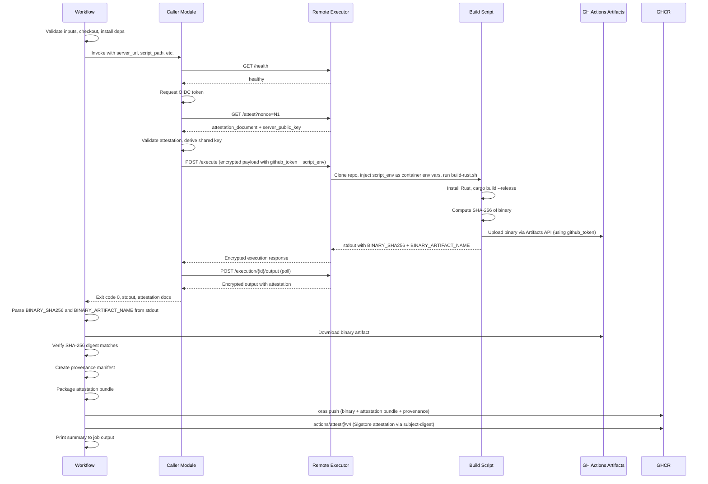

# Design Document: Attested Rust Build Pipeline

## Overview

This design describes a GitHub Actions workflow and supporting scripts that build a Rust binary inside an attested AWS Nitro Enclave environment, verify the binary's integrity, bundle it with attestation documents, push the result to GHCR as an OCI artifact via Oras, and create a GitHub Artifact Attestation for supply-chain provenance.

The system reuses the `call_remote_executor` Python module from the `github-runner-ec2-attestation-caller` project (copied into this repository) to handle the attested communication channel: health check, OIDC token acquisition, NitroTPM attestation validation, PQ_Hybrid_KEM key exchange, encrypted execution submission, output polling, and output integrity verification.

The build script runs on the Remote Executor inside the enclave, installs the Rust toolchain, compiles the binary, computes its SHA-256 digest, and uploads the binary to GitHub Actions Artifacts using the `github_token` passed through the encrypted payload. The workflow then downloads the binary, verifies its digest, creates a provenance manifest, pushes everything to GHCR via Oras, and creates a Sigstore-based GitHub Attestation.

### Key Design Decisions

1. **Copy the caller module** rather than referencing it as a git submodule. This keeps the demo self-contained and avoids cross-repository dependency management. The module is placed at `.github/scripts/call_remote_executor/`.

2. **Use the GitHub Actions Artifacts API directly from the build script** (via `curl` and the `github_token`) to transfer the binary out of the enclave. The Remote Executor has no shared filesystem with the GitHub Actions runner, so Artifacts serve as the transfer mechanism.

3. **Use Oras CLI** for OCI artifact push rather than Docker. The binary is not a container image — it's an arbitrary artifact with attestation metadata layers.

4. **Two-layer attestation**: The Nitro attestation bundle proves the binary was built in a trusted enclave. The GitHub Artifact Attestation (Sigstore) proves the OCI artifact was produced by a specific GitHub Actions workflow run.

## Architecture

### System Context Diagram

```mermaid
graph TB
    subgraph "GitHub Actions Runner"
        WF[Workflow: attested-rust-build.yml]
        CALLER[Caller Module<br/>call_remote_executor]
        SIGN[Signing & Packaging Script]
        ORAS[Oras CLI]
        GH_ATT[actions/attest@v4]
    end

    subgraph "AWS Nitro Enclave"
        RE[Remote Executor Server]
        BS[Build Script: build-rust.sh]
        RUST[Rust Toolchain + Cargo]
    end

    subgraph "External Services"
        GHCR[GHCR<br/>ghcr.io]
        GHA_ART[GitHub Actions<br/>Artifacts API]
        OIDC[GitHub OIDC Provider]
        SIGSTORE[Sigstore / Fulcio]
    end

    WF --> CALLER
    CALLER -->|"Attested Channel<br/>(PQ_Hybrid_KEM)"| RE
    RE --> BS
    BS --> RUST
    BS -->|"Upload binary via<br/>github_token"| GHA_ART
    CALLER -->|"OIDC Token"| OIDC
    WF -->|"Download binary"| GHA_ART
    WF --> SIGN
    SIGN --> ORAS
    ORAS -->|"Push OCI artifact"| GHCR
    WF --> GH_ATT
    GH_ATT -->|"Create attestation"| SIGSTORE
    GH_ATT -->|"Bind to OCI digest"| GHCR
```

### Sequence Diagram



## Components and Interfaces

### 1. Rust Project (`rust-project/`)

A minimal Rust project that compiles into the `attested-hello` binary.

**Files:**
- `rust-project/Cargo.toml` — Binary target `attested-hello`
- `rust-project/src/main.rs` — Prints version string and build timestamp

**Interface:** Compiled via `cargo build --release`, produces `rust-project/target/release/attested-hello`.

### 2. Build Script (`scripts/build-rust.sh`)

Shell script executed by the Remote Executor inside the enclave.

**Inputs (environment):**
- Working directory: repository root (cloned by Remote Executor)
- `GITHUB_TOKEN` — passed via the encrypted execution payload's `script_env` dictionary
- `GITHUB_RUN_ID` — the workflow run ID, passed via the encrypted execution payload's `script_env` dictionary
- `GITHUB_REPOSITORY` — the repository slug, passed via the encrypted execution payload's `script_env` dictionary
- `ACTIONS_RUNTIME_TOKEN` — runtime token for the v3 pipeline artifacts REST API, passed via the encrypted execution payload's `script_env` dictionary
- `ACTIONS_RUNTIME_URL` — base URL for the Actions runtime API, passed via the encrypted execution payload's `script_env` dictionary

**Note on environment variable forwarding:** All five environment variables are forwarded from the GitHub Actions runner to the Execution_Container via the `script_env` field in the encrypted /execute payload. The caller module includes them in the `script_env` dictionary, the Remote Executor server extracts and sanitizes the dictionary, and the Script_Executor injects them as container environment variables. This is necessary because the Execution_Container runs in an isolated Docker environment with no access to the GitHub Actions runner's environment.

**Note on Artifacts API version:** The build script uses the v3 pipeline artifacts REST API (`_apis/pipelines/workflows/{run_id}/artifacts`) because the enclave environment only has `curl` available — the v4 API requires the `@actions/artifact` Node.js package. The v3 API is deprecated but remains functional and is the only practical option for uploading artifacts from non-runner environments. The workflow-side download uses `actions/download-artifact@v4`, which is backward-compatible with v3-uploaded artifacts.

**Outputs (stdout markers):**
- `BINARY_SHA256:<hex_digest>` — SHA-256 of the compiled binary
- `BINARY_ARTIFACT_NAME:<name>` — Name of the uploaded GitHub Actions artifact

**Algorithm:**
```
1. Install Rust toolchain via rustup (if not present)
2. cd rust-project/
3. cargo build --release
4. Compute: sha256sum target/release/attested-hello → BINARY_SHA256
5. Upload target/release/attested-hello to GitHub Actions Artifacts API (v3)
   using curl + github_token + ACTIONS_RUNTIME_TOKEN + ACTIONS_RUNTIME_URL
   Note: Uses the v3 pipeline artifacts REST API since the enclave environment
   only has curl available (no Node.js @actions/artifact package). The v3 API
   is deprecated but remains the only option for non-runner environments.
6. Print BINARY_SHA256:<digest> and BINARY_ARTIFACT_NAME:<name>
```

**Error handling:** Each step checks exit codes. Failures print descriptive errors to stderr and exit non-zero.

### 3. Caller Module (`.github/scripts/call_remote_executor/`)

Copied from `github-runner-ec2-attestation-caller`. This is the Python package that handles the full attested communication lifecycle.

**Files (copied as-is):**
- `__init__.py`, `__main__.py`, `cli.py`, `caller.py`, `encryption.py`, `attestation.py`, `artifact.py`, `errors.py`

**Interface:** Invoked as `python .github/scripts/call_remote_executor --server-url ... --script-path ... --github-token ... --root-cert-pem ... --expected-pcrs ... --attestation-output-dir attestation-documents --script-env GITHUB_RUN_ID=... --script-env GITHUB_REPOSITORY=... --script-env ACTIONS_RUNTIME_TOKEN=... --script-env ACTIONS_RUNTIME_URL=...`

**Outputs:**
- Exit code (0 = success)
- stdout/stderr from the remote execution (including the `BINARY_SHA256` and `BINARY_ARTIFACT_NAME` markers)
- `attestation-documents/` directory containing server-identity, execution-acceptance, and output-integrity attestation documents plus `manifest.json`

### 4. Workflow (`.github/workflows/attested-rust-build.yml`)

The orchestrating GitHub Actions workflow.

**Inputs:**
| Input | Required | Default | Description |
|---|---|---|---|
| `server_url` | Yes | — | Base URL of the Remote Executor server |
| `script_path` | No | `scripts/build-rust.sh` | Path to build script |
| `commit_hash` | No | Current SHA | Git commit to build |
| `repository_url` | No | Current repo | Git repository URL |
| `audience` | No | — | OIDC audience value |
| `server_url_allowlist` | No | — | Comma-separated allowed server URLs |

**Permissions:** `id-token: write`, `contents: read`, `packages: write`, `attestations: write`

**Steps:**
1. Validate inputs (non-empty server_url, allowlist check)
2. Checkout repository at commit_hash
3. Install Python 3.11 + caller dependencies
4. Run caller module (captures stdout to file via `tee`)
5. Parse `BINARY_SHA256` and `BINARY_ARTIFACT_NAME` from captured stdout
6. Download binary artifact via `actions/download-artifact@v4`
7. Verify SHA-256 digest of downloaded binary
8. Create provenance manifest (JSON)
9. Package attestation bundle (tar.gz of attestation-documents/)
10. Install Oras CLI
11. `oras login` to GHCR with `GITHUB_TOKEN`
12. `oras push` with binary layer, attestation bundle layer, provenance annotation
13. `actions/attest@v4` with `subject-name` (OCI image name) and `subject-digest` (OCI manifest digest), `push-to-registry: true` (with `continue-on-error: true`)
14. Check attestation step outcome; print warning to `$GITHUB_STEP_SUMMARY` on failure
15. Print summary to `$GITHUB_STEP_SUMMARY`
16. Upload attestation-documents as GitHub Actions artifact (always, even on failure)

### 5. Provenance Manifest

A JSON document that ties together the binary, attestation chain, and build metadata.

**Schema:**
```json
{
  "version": "1.0",
  "binary": {
    "name": "attested-hello",
    "sha256": "<hex_digest>"
  },
  "build": {
    "repository_url": "https://github.com/<owner>/<repo>",
    "commit_hash": "<sha>",
    "workflow_run_id": "<run_id>",
    "timestamp": "<ISO8601>"
  },
  "attestation": {
    "server_identity": "attestation-documents/server-identity.b64",
    "execution_acceptance": "attestation-documents/execution-acceptance.b64",
    "output_integrity": "attestation-documents/output-integrity-poll-001.b64",
    "manifest": "attestation-documents/manifest.json"
  }
}
```

## Data Models

### Build Script Output Protocol

The build script communicates results to the workflow via stdout markers embedded in the execution output:

| Marker | Format | Description |
|---|---|---|
| `BINARY_SHA256` | `BINARY_SHA256:<64-char-hex>` | SHA-256 digest of the compiled binary |
| `BINARY_ARTIFACT_NAME` | `BINARY_ARTIFACT_NAME:<string>` | Name of the uploaded GitHub Actions artifact |

These markers are parsed by the workflow using `grep` after the caller completes.

### OCI Artifact Structure

The Oras push creates an OCI manifest with the following layers:

| Layer | Media Type | Description |
|---|---|---|
| Binary | `application/octet-stream` | The `attested-hello` executable |
| Attestation Bundle | `application/vnd.attestation.bundle+tar.gz` | Tar.gz of `attestation-documents/` |
| Provenance Manifest | `application/vnd.attestation.provenance+json` | JSON provenance manifest |

**OCI Reference:** `ghcr.io/<owner>/<repo>/attested-hello:<short-sha>`

### Attestation Documents Directory Structure

```
attestation-documents/
├── server-identity.b64
├── server-identity.payload.json
├── execution-acceptance.b64
├── execution-acceptance.payload.json
├── output-integrity-poll-001.b64
├── output-integrity-poll-001.payload.json
└── manifest.json
```

### File Tree (Complete Project)

```
github-runner-ec2-attestation-rust-build-demo/
├── .github/
│   ├── scripts/
│   │   └── call_remote_executor/       # Copied from caller project
│   │       ├── __init__.py
│   │       ├── __main__.py
│   │       ├── cli.py
│   │       ├── caller.py
│   │       ├── encryption.py
│   │       ├── attestation.py
│   │       ├── artifact.py
│   │       └── errors.py
│   └── workflows/
│       └── attested-rust-build.yml
├── rust-project/
│   ├── Cargo.toml
│   └── src/
│       └── main.rs
├── scripts/
│   └── build-rust.sh
├── pyproject.toml
├── .gitignore
└── README.md
```


## Correctness Properties

*A property is a characteristic or behavior that should hold true across all valid executions of a system — essentially, a formal statement about what the system should do. Properties serve as the bridge between human-readable specifications and machine-verifiable correctness guarantees.*

Three areas of this feature contain pure logic suitable for property-based testing: stdout marker parsing, server URL allowlist validation, and provenance manifest generation. The remainder of the feature is workflow orchestration (YAML), shell scripting, and external service integration — tested via smoke tests, example-based tests, and integration tests.

### Property 1: Stdout marker round-trip

*For any* marker type (`BINARY_SHA256` or `BINARY_ARTIFACT_NAME`) and *for any* valid marker value (64-char hex string for SHA256, non-empty string without newlines for artifact name), embedding the marker in arbitrary stdout text as `<MARKER_TYPE>:<value>` and then parsing the stdout to extract the value SHALL return the original value.

**Validates: Requirements 2.4, 2.5, 4.2, 4.3, 4.4**

### Property 2: Server URL allowlist acceptance

*For any* server URL and *for any* comma-separated allowlist of URLs, the server URL SHALL be accepted if and only if it appears (after whitespace trimming) as an exact match in the allowlist. When the allowlist is empty, all URLs SHALL be accepted.

**Validates: Requirements 3.4**

### Property 3: Provenance manifest completeness

*For any* valid binary name, SHA-256 hex digest, repository URL, commit hash, workflow run ID, and ISO 8601 timestamp, the generated provenance manifest JSON SHALL contain all of these values in the correct fields, and parsing the JSON back SHALL yield the original input values.

**Validates: Requirements 5.2**

## Error Handling

### Build Script Errors

| Error Condition | Behavior | Exit Code |
|---|---|---|
| Rust toolchain installation fails | Print descriptive error to stderr | Non-zero |
| `cargo build --release` fails | Print compiler error output to stderr | Non-zero |
| GitHub Actions Artifact upload fails | Print upload error to stderr | Non-zero |
| `github_token` missing or invalid | Print auth error to stderr | Non-zero |

### Workflow Errors

| Error Condition | Behavior |
|---|---|
| `server_url` is empty | Fail job with `::error::` annotation |
| `server_url` not in allowlist | Fail job with `::error::` annotation |
| Caller exits non-zero | Fail job, upload attestation docs (if any) |
| `BINARY_SHA256` marker missing from stdout | Fail job with descriptive error |
| `BINARY_ARTIFACT_NAME` marker missing from stdout | Fail job with descriptive error |
| Downloaded binary SHA-256 mismatch | Fail job with integrity mismatch error showing expected vs actual |
| `oras push` fails | Fail job, print Oras error to stderr |
| `actions/attest@v4` step fails | Print warning via step outcome check, do NOT fail job (OCI artifact already uploaded) |
| Artifact download fails | Fail job with descriptive error |

### Error Propagation Strategy

- The build script uses `set -euo pipefail` to fail fast on any command error.
- The workflow uses shell `set -euo pipefail` in each run step.
- The attestation document upload step uses `if: always()` to ensure attestation artifacts are preserved even when later steps fail.
- The GitHub Attestation step uses `continue-on-error: true` since it's a supplementary provenance layer — the Nitro attestation bundle is the primary trust anchor. A subsequent step checks `steps.<id>.outcome` and emits a `::warning::` annotation when the attestation failed, ensuring the failure is visible in the job summary rather than silently masked.

## Testing Strategy

### Testing Approach

This feature uses a dual testing approach:

1. **Property-based tests** — Verify universal properties of the pure logic components (marker parsing, allowlist validation, provenance manifest generation) using Hypothesis (Python PBT library). Minimum 100 iterations per property.
2. **Unit tests** — Verify specific examples, edge cases, and error conditions for the parsing and manifest logic.
3. **Smoke tests** — Verify static configuration (YAML structure, file existence, dependency declarations).
4. **Integration tests** — End-to-end workflow execution (manual, requires Remote Executor server).

### Property-Based Tests (Hypothesis)

Each property test references its design document property and runs a minimum of 100 iterations.

| Test | Property | Description |
|---|---|---|
| `test_marker_roundtrip` | Property 1 | Generate random marker values, embed in random stdout, parse back |
| `test_allowlist_validation` | Property 2 | Generate random URLs and allowlists, verify accept/reject logic |
| `test_provenance_manifest_completeness` | Property 3 | Generate random build metadata, create manifest, verify all fields |

Tag format: **Feature: rust-attestated-build, Property {number}: {property_text}**

### Unit Tests

| Test | Requirement | Description |
|---|---|---|
| `test_parse_sha256_marker` | 2.4, 4.4 | Parse a known BINARY_SHA256 marker from sample stdout |
| `test_parse_artifact_name_marker` | 2.5, 4.4 | Parse a known BINARY_ARTIFACT_NAME marker from sample stdout |
| `test_missing_sha256_marker_raises` | 4.8 | Verify error when BINARY_SHA256 is missing |
| `test_missing_artifact_name_marker_raises` | 4.8 | Verify error when BINARY_ARTIFACT_NAME is missing |
| `test_sha256_mismatch_detected` | 4.7 | Verify digest mismatch is detected |
| `test_provenance_manifest_schema` | 5.2 | Verify manifest JSON matches expected schema |
| `test_allowlist_empty_accepts_all` | 3.4 | Verify empty allowlist accepts any URL |
| `test_allowlist_rejects_unlisted` | 3.4 | Verify URL not in allowlist is rejected |

### Smoke Tests

| Test | Requirement | Description |
|---|---|---|
| `test_workflow_yaml_inputs` | 3.1 | Verify workflow_dispatch inputs in YAML |
| `test_workflow_yaml_permissions` | 3.2 | Verify permissions in YAML |
| `test_workflow_yaml_root_cert` | 8.4 | Verify ROOT_CERT_PEM env var in YAML |
| `test_workflow_yaml_expected_pcrs` | 8.5 | Verify EXPECTED_PCRS env var in YAML |
| `test_cargo_toml_binary_target` | 1.1 | Verify Cargo.toml has attested-hello target |
| `test_pyproject_dependencies` | 8.1 | Verify pyproject.toml has caller dependencies |
| `test_gitignore_patterns` | 8.2 | Verify .gitignore has required patterns |

### Test Framework

- **Language:** Python 3.11
- **Test runner:** pytest
- **PBT library:** Hypothesis (>= 6.0.0)
- **Configuration:** Minimum 100 examples per property test via `@settings(max_examples=100)`

### What Is NOT Tested Automatically

- End-to-end workflow execution (requires a live Remote Executor server and GitHub Actions environment)
- Oras push to GHCR (requires registry access)
- `actions/attest@v4` (requires Sigstore/Fulcio and GitHub Actions environment)
- Build script execution on the Remote Executor (requires enclave environment)

These are verified via manual integration testing by triggering the workflow.
